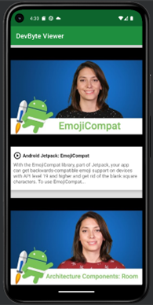

DevByteRepository - Solution Code
==================================

Solution code for the Repository codelab.

Introduction
------------

DevByteRepository app displays a list of DevByte videos. DevByte videos are
short videos made by the Google Android developer relations team to introduce
new developer features on Android. This app demonstrates the Repository pattern,
the recommended best practice for code separation and architecture. Using
repository pattern the data layer is abstracted from the rest of the app.
Repositories act as mediators between different data sources, such as persistent
models, web services, and caches and the rest of the app.

Pre-requisites
--------------

You need to know:
- How to open, build, and run Android apps with Android Studio.
- The basic Android Architecture Components, ViewModel, and LiveData.
- The data persistence library, Room.
- Building and launching a coroutine.
- Read the logs using the Logcat.
- Binding adapters in data binding.
- Using the Retrofit networking library.

Getting Started
---------------

1. Download and run the app.
2. You need Android Studio 3.4 or higher to build this project.

License
-------

Copyright 2019 Google, Inc.

Licensed to the Apache Software Foundation (ASF) under one or more contributor
license agreements.  See the NOTICE file distributed with this work for
additional information regarding copyright ownership.  The ASF licenses this
file to you under the Apache License, Version 2.0 (the "License"); you may not
use this file except in compliance with the License.  You may obtain a copy of
the License at

  http://www.apache.org/licenses/LICENSE-2.0

Unless required by applicable law or agreed to in writing, software
distributed under the License is distributed on an "AS IS" BASIS, WITHOUT
WARRANTIES OR CONDITIONS OF ANY KIND, either express or implied.  See the
License for the specific language governing permissions and limitations under
the License.
